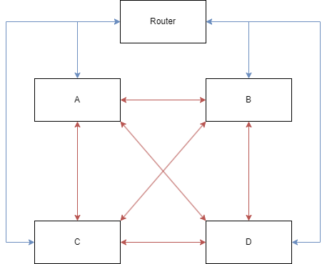
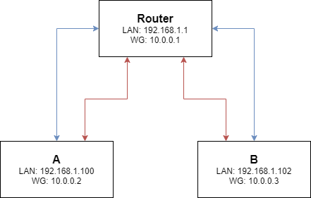
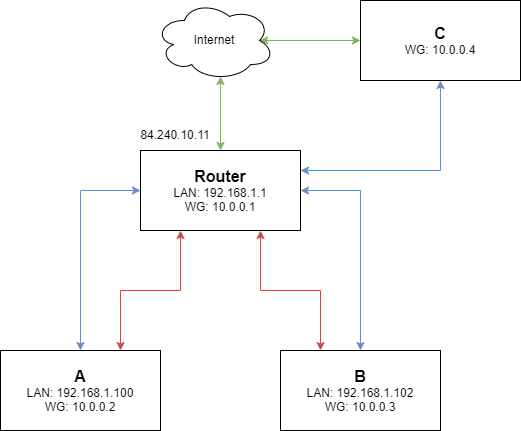

In this post we explore the possibilty to configure WireGuard VPN in such a way that
peers in the network can talk to each other without invdividually having to be peered with each node (also called fully connected topology).

<!-- more -->

## A typical WireGuard network (fully connected topology)



A typical WireGuard network is shown in the diagram above.
Blue lines are physical LAN links between the router and nodes
And red lines are the WireGuard VPN links.

This is typically fine for most setups as you have finegrain controll over what nodes are peered together. but it requires alot more configuration. In the diagram above, each node has 3 peers (as there are 4 nodes total). What if the number of nodes increases? if we have N nodes, each node needs to have N-1 peers.

So if we would have a VPN network of 10. and we add another node. we need to peer that node with the 9 others.
That means, not only do we need to configure our new node, we also need to update the config for all other 9 nodes.
That is alot of configuration and this scales as the number of nodes are introduced to the network.

In this case, all nodes should be able to talk to eachother. Could we configure the router to handle this?
Lets see if we can configure WireGuard in a star topology.

## Star topology



This type of network topology is quite common, in fact this is how you would set up a network using a router or switch (notice how each WireGuard link has exaclty one physical link aswell).
The question is, could we also configure WireGuard as a star network? That way, nodes need only to be peered with a central node (likley a router). That node in return is peered with every other node.

### How WireGuard works

Now, the key to configure this type of network is to understand WireGuards `Address` and `allowedIPs` field. Because WireGuard operates in the L3 layer of the network. It can not route packages using MAC addresses (like a traditional router). instead WireGuard only relies on IP addresses (and the cryptographic keys)

#### Address

The `Address` field tells WireGuard two things:

1. What IP should be associated with the interface.

2. The network block that tells the host what other IP Addresses are **routeable** through the interface.

Lets make this more clear with an example, Lets say that the Address is `10.0.0.1/32`

WireGuard will setup an interface with the ip `10.0.0.1` and no route is added because it is simply not needed.
The system already know that `10.0.0.1` is associated with the WireGuard interface and there is no other addresses.

If the Address is set to `10.0.0.1/24` on the other hand. WireGuard will set up a route for the `/24` block, meaning all addresses withing `10.0.0.0`-`10.0.0.255` is routed through the WireGuard interface.

#### AllowedIPs

Now, it is not enough to configure what addresses should be routed through the interface. WireGuard also looks in the Peer's `allowedIPs` field to know what **outbound** packages with **destination** ip are allowed through the interface aswell as what **inbound** packages with **source ip** are allowed to go through. If the address is not in the range, WireGuard drops it.

Lets see with an example, consider the following config:

```ini
[Interface]
PrivateKey = aaa
Address = 10.0.0.1/32

[Peer]
PublicKey = bbb
AllowedIPs = 10.0.0.2/32
PersistentKeepalive = 20
```

The following table demonstrates package flow from Host A's viewpoint.

| Source   | Destination | Inbound/Outbound | Action |
|--------- |-----------|---------|----------|
| 10.0.0.9 | 10.0.0.1  | Inbound | Dropped (`10.0.0.9` is not in Peers AllowedIPs) |
| 10.0.0.2 | 10.0.0.1  | Inbound | Accepted (`10.0.0.2` is in AllowedIPs) |
| 10.0.0.1 | 10.0.0.2  | Outbound | Accepted (`10.0.0.2` is in AllowedIPs) |
| 10.0.0.1 | 10.0.0.9  | Outbound | Dropped (`10.0.0.9` is not in AllowedIPs) |

As you can see. In WireGuard is it not enough to just add the correct routes, one must also configure WireGuard so that the right addresses are **allowed**.

::: warning NOTE
This is not a substitute for a firewall as all that WireGuard does is to look at the ips. One should in all cases have a real firewall that can more capable of guarding your network properly.
:::

### Setup

Now with this information, we can configure the 3 nodes. A, B and R (router)

We need to configure WireGuard in such a way that

1. Packages between A and any node with an IP in the `10.0.0.0/24` range going through R is allowed.
2. Packages between B and any node with an IP in the `10.0.0.0/24` range going through R is allowed.

```ini
[Interface]
PrivateKey = rrr
Address = 10.0.0.1/24
ListenPort = 443

[Peer]
PublicKey = aaa
AllowedIPs = 10.0.0.2/32
PersistentKeepalive = 20

[Peer]
PublicKey = bbb
AllowedIPs = 10.0.0.3/32
PersistentKeepalive = 20
```

Here we define the router's address aswell as the network block `10.0.0.1/24`. We want any address from `10.0.0.0`-`10.0.0.255`
to be routed through the interface.

next we define the peers, notice that we set `/32` and the peers IP here. That is because we only want traffic from and to `10.0.0.2` to go to/from this peer. as the same for `10.0.0.3`

::: warning NOTICE

For this to work you need to configure IP [forwardning](https://linuxconfig.org/how-to-turn-on-off-ip-forwarding-in-linux) in linux aswell. Otherwise the kernel will not allow packages to be forwarded to other hosts.
:::

Now lets look at A's config

```ini
[Interface]
PrivateKey = aaa
Address = 10.0.0.2/24

[Peer]
PublicKey = rrr
AllowedIPs = 10.0.0.0/24
Endpoint = 192.168.1.1:443
PersistentKeepalive = 20
```

and B aswell. it's almost identical

```ini
[Interface]
PrivateKey = bbb
Address = 10.0.0.3/24

[Peer]
PublicKey = rrr
AllowedIPs = 10.0.0.0/24
Endpoint = 192.168.1.1:443
PersistentKeepalive = 20
```

Here we set `AllowedIPs` to `10.0.0.0/24`. This is important as we want to accept packages going **out** to any IP in `10.0.0.0`-`10.0.0.255` as well as packages comming **in** from `10.0.0.0`-`10.0.0.255`

That way as we add a new node lets say C with ip `10.0.0.4` we already allowes it with this configuration.

Now with this setup. from A we can reach B via `10.0.0.3` without directly being peered with B and vice versa.

## Adding a external node to the network

Now just because. lets introduce a external node to the network (maybe your laptop when you are out and about).



::: info IMPORTANT
Make sure you configure your firewall to accept port `443 udp` from WAN. Otherwise C will not be able to peer with the router.
Also change the public ip to your actual public ip.
:::

Config for C

```ini
[Interface]
PrivateKey = ccc
Address = 10.0.0.4/24

[Peer]
PublicKey = rrr
AllowedIPs = 10.0.0.0/24
Endpoint = 84.240.10.11:443
PersistentKeepalive = 20
```

And now we just add C to the router.

```ini
[Interface]
PrivateKey = rrr
Address = 10.0.0.1/24
ListenPort = 443

[Peer]
PublicKey = aaa
AllowedIPs = 10.0.0.2/32
PersistentKeepalive = 20

[Peer]
PublicKey = bbb
AllowedIPs = 10.0.0.3/32
PersistentKeepalive = 20

[Peer] // [!code ++]
PublicKey = ccc // [!code ++]
AllowedIPs = 10.0.0.4/32 // [!code ++]
PersistentKeepalive = 20 // [!code ++]
```

And thats it! Now C has joined the party.

## References

* https://www.javatpoint.com/what-is-star-topology
* https://www.procustodibus.com/blog/2020/10/wireguard-topologies/#point-to-site
* https://www.procustodibus.com/blog/2021/01/wireguard-endpoints-and-ip-addresses/

